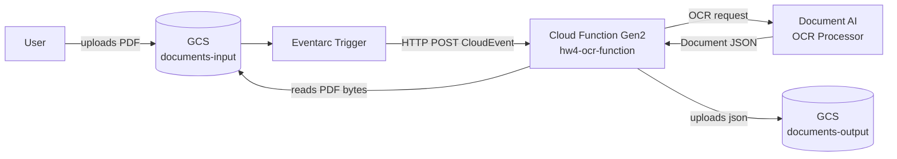

# HW4 Architecture: PDF OCR Pipeline

DocumentAI OCR pipeline. Triggered when a user uploads a PDF file to the input bucket, extracts JSON using DocumentAI, and stores the result in the output bucket.

## Diagram

