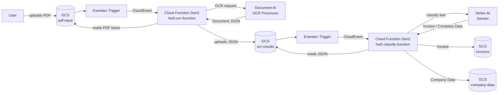

# HW5: PDF OCR + Classification Pipeline

Two-stage serverless pipeline: OCR extracts text from uploaded PDFs, then a Vertex AI Gemini-powered classifier routes each JSON result to a dedicated bucket based on document type (Invoice or Company Data).

## Diagram

## Buckets

| Bucket | Purpose |
|--------|---------|
| `{project}-pdf-input` | Raw PDF uploads (pipeline entry point) |
| `{project}-ocr-results` | Intermediate OCR JSON (feeds classifier) |
| `{project}-invoices` | Classified invoice documents |
| `{project}-company-data` | Classified company data documents |
| `{project}-hw5-function-source` | Cloud Function deployment archives |

## Classification

`hw5-classify-function` sends the OCR text to **Vertex AI Gemini** (`gemini-2.0-flash-001`) with a zero-shot prompt asking it to label the document as *Invoice* or *Company Data*. The result determines which output bucket receives the JSON.
